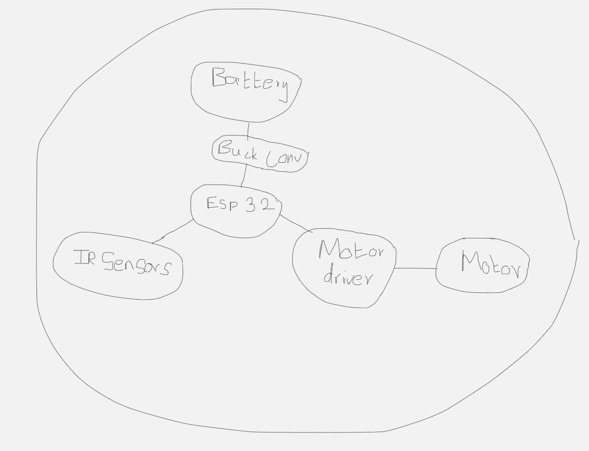
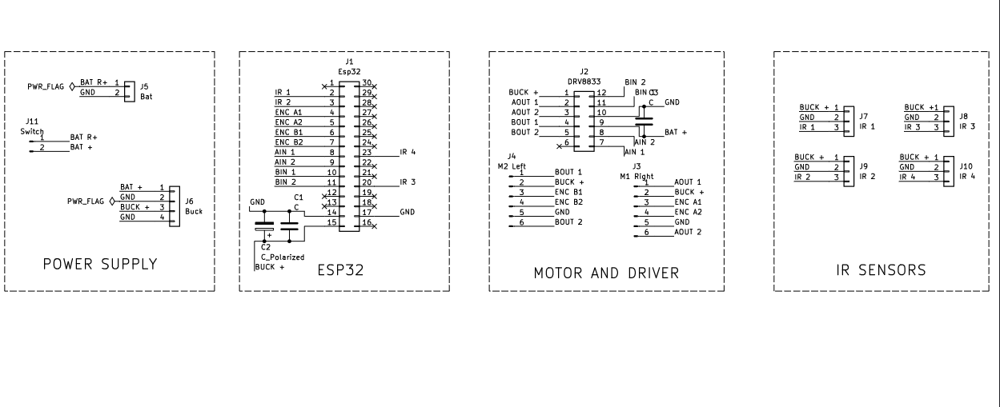
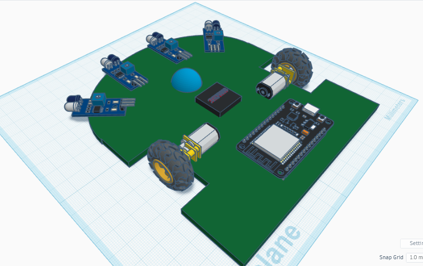
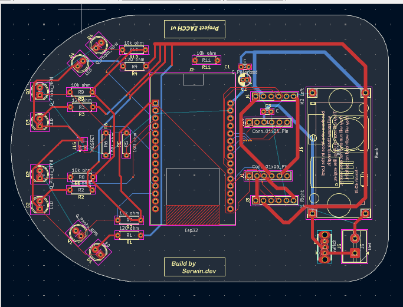
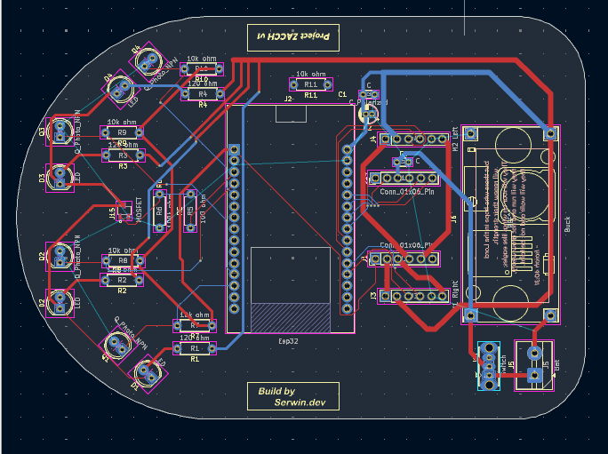
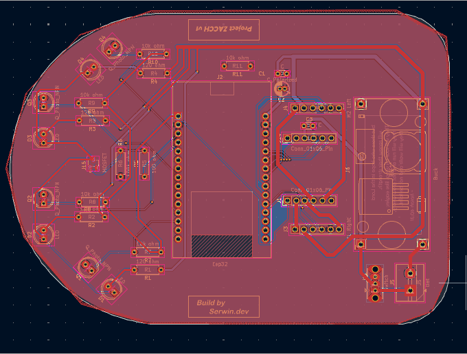

# Project Zacch v1

## About the project

Project Zacch is a full-size micromouse whose aim is to solve the maze autonomously.

The name of the mouse actually comes from Bible (Luke 19:1-10). There was a man called Zacchaeus -- who wanted to see Jesus but because he was short, he couldn't able to see Him. So he climbed a tree to see Jesus.

The dimension of Zacch is 90mm x 127mm (3.54 x 5.00 inches). Compared to other mice out there, it isn't that small. But this is my first-ever hardware project and i needed some more space to work properly.

The Project Zacch v1 is a project made for the event ["Fallout"](https://fallout.hackclub.com/) conducted by [HackClub](https://hackclub.com/).

---

## BOM

|sno|product name         |description                                  |Quantity |link                                                                                                                                                                                                                                                                                                                                                                                             |unit price |amount |Running total |   |
|---|---------------------|---------------------------------------------|---------|-------------------------------------------------------------------------------------------------------------------------------------------------------------------------------------------------------------------------------------------------------------------------------------------------------------------------------------------------------------------------------------------------|-----------|-------|--------------|---|
|  1| ESP32               | Brain of the Mouse                          |        1| [link](https://makerbazar.in/products/esp32-wroom-wifi-ble-bluetooth-iot-node-mcu-board?variant=48251049935088)                                                                                                                                                                                                                                                                                         |     445.00| 445.00|        445   |   |
|  2| Motor Driver        | Bridge between Brain and motor              |        1| [link](https://makerbazar.in/products/drv8833-2-channel-1-5a-dc-motor-driver?variant=48341841346800)                                                                                                                                                                                                                                                                                                    |      65.00|  65.00|        510   |   |
|  3| Motors with encoders| Locomotive device to calculate it's position|        2| [link](https://roboticsdna.in/product/n20-6v-500rpm-micro-metal-gear-motor-with-encoder/ )                                                                                                                                                                                                                                                                                                              |     494   | 988   |       1498   |   |
|  4| Infrared Sensors    | Eyes to watch out for obstacles             |        2| [link](https://makerbazar.in/products/ir-receiver-transistor-led?variant=42847315525872)                                                                                                                                                                                                                                                                                                                |      99.00| 198   |       1696   |   |
|  5| Battery             | To power the mouse                          |        1| [link](https://robu.in/product/wly603040-600mah-3-7v-single-cell-rechargeable-lipo-battery/?utm_source=chatgpt.com)                                                                                                                                                                                                                                                                                     |     198   | 198   |       1894   |   |
|  6| MOSFET              | To switch on the IR leds                    |        2| [link](https://www.digikey.in/en/products/detail/alpha-omega-semiconductor-inc/AO3400A/1855772)                                                                                                                                                                                                                                                                                                         |      49.15|  98.30|       1992.3 |   |
|  7| Resistors pack      | TO limit the current                        |        1| [link](https://robu.in/product/30-different-valued-metal-film-resistor-assorted-kit-for-diy-electronic-projects-and-experiments/)                                                                                                                                                                                                                                                                       |     199.00| 199.00|       2191.3 |   |
|  8| Wheels              | Pair of wheels suitable for N20             |        1| [link](https://dyoraarobotics.in/product/2)                                                                                                                                                                                                                                                                                                                                                             |     269   | 269   |       2460.3 |   |
|  9| Caster ball         | Non-driven wheel to support the mouse       |        1| [link](https://makerbazar.in/products/mini-3pi-car-n20-caster-robot-ball-wheel)                                                                                                                                                                                                                                                                                                                         |      39   |  39   |       2499.3 |   |
| 10| Boost converter     | To convert low voltage into 5v              |        1| [link](https://robocraze.com/products/tps61023-3-7a-5v-output-mini-boost-converter-breakout-board-7semi?srsltid=AfmBOorZcjLyfdjhu4-ktQiGOcvzMeDhyjm8kQI_HV5Uemv6zVHmJe5q)                                                                                                                                                                                                                               |      87   |  87   |       2586.3 |   |
| 11| Switch              | To power ON/OFF                             |        1| [link](https://makerbazar.in/products/3-pin-dip-mini-slide-switch-through-hole-pcb-slide-button?variant=46800238575856)                                                                                                                                                                                                                                                                                 |      55   |  55   |       2641.3 |   |
| 12| Screw terminal      | To connect battery                          |        1| [link](https://makerbazar.in/products/wire-to-board-screw-terminal-connectors?srsltid=AfmBOorlYyyEAAogTVcPhF7FhGmk6QyMP0Ij64HXCppaQqRuH7ws5u8H&variant=48816549658864)                                                                                                                                                                                                                                  |      25   |  25   |       2666.3 |   |
| 13| Capacitor 47uF      | Caps to store energy                        |        3| [link](https://www.mouser.in/en/ProductDetail/Panasonic/ECA-1HHG470?qs=sGAEpiMZZMsh%252B1woXyUXj0KTxVgEP8%2FoesVWFq9mWps%3D)                                                                                                                                                                                                                                                                            |      17.89|  53.67|       2719.97|   |
| 14| Capacitor 0.1uF     | Caps                                        |       10| [link](https://robu.in/product/rder71h104k0m1h03a-murata-electronics-%C2%B110-50v-100nf-x7r-pluginp5mm-multilayer-ceramic-capacitors-mlcc-leaded-rohs/?gad_source=1&gad_campaignid=17427802703&gbraid=0AAAAADvLFWefn6i5u6u06P2ikuNaq8nHi&gclid=CjwKCAjwvNfSBhBiEiwAyaGMCc8RoM_25v4rTFsFHUdJuWaXGIPravkARzQQLWtrZbm0opEAT2KkExoCW2IQAvD_BwE)                                                             |      16.00| 160   |       2879.97|   |
| 15| Female headers      | To mount componenets                        |        3| [link](https://makerbazar.in/products/female-berg-strip-2-54mm-header-pin?variant=46822716735728&country=IN&currency=INR&utm_medium=product_sync&utm_source=google&utm_content=sag_organic&utm_campaign=sag_organic&gad_source=1&gad_campaignid=17426677322&gbraid=0AAAAACLxaAblJEnB5dLql7-x3ZBpJzfe3&gclid=CjwKCAjwmdLSBhANEiwAkREMN3OXcRsLFpE1FGKxTkcoRNSS2PXJgUW0fRO1fCnhbYDCYuGI9XgbIRoCBOQQAvD_BwE)|       8.5 |  25.50|       2905.47|   |
| 16| Male headers        | To mount components                         |        2| [link](https://makerbazar.in/products/berg-strip-40-pins?variant=49811925532912&country=IN&currency=INR&utm_medium=product_sync&utm_source=google&utm_content=sag_organic&utm_campaign=sag_organic&gad_source=1&gad_campaignid=17426677322&gbraid=0AAAAACLxaAblJEnB5dLql7-x3ZBpJzfe3&gclid=CjwKCAjwmdLSBhANEiwAkREMNz77SH8W3c11Vlf4g-hZFOluHlT7KyqQvG2HieT2qgm2LeFkTQocnRoCc5MQAvD_BwE)                 |      25   |  50   |       2955.47|   |
| 17| Tactile switch      | To actually make mouse move                 |        1| [link](https://makerbazar.in/products/small-push-button-switch?srsltid=AfmBOoqmTbENfx2a-pJnI3aoowbEo9liCWUeOjVfWND0_L68pnGFyOcG)                                                                                                                                                                                                                                                                        |      20   |  20   |       2975.47|   |

---

## Project Workflow

I have actually journalled everything from Day 1 till the end -- you can find them in the **Devlogs folder**.

#### Research and Development

- On the Day 1, i worked on researching the requirments for the project.
- On further days, i sourced online to find the suitable products and built the BOM (Bill of materials) -- which you can find [here](components/BOM.csv) and also sketched a very rough diagram about the wiring.

---

#### Schematic 

- From day 4, i worked on the Schematic design in Kicad. It's my very first time and i found it kinda hard at first.
- After some several iterations and struggles, with the help of chatGPT, i finished the 1st version of schematic on day 7

---

#### CAD design

- From Day 8, i worked on the CAD design of this project in Tinkercad
- After two days of CAD'ing, i somehow managed to capture the vision in my mind into the Screen. (Spoiler alert: Final result isn't the same as here)

---

#### PCB design

- After the completion of CAD design, i started to add footprints for all the componenets in kicad.
- I found it hard to understand the way footprint works in the consecutive days.
- During these days, i changed the IR sensors - from modules to separate transmiter. (Reason: Because the module provides only True or False output based on whether the obstacle is near or not)
- I completed the whole routing of PCB by the day 20, but then i found that esp32 has been misaligned and needs to be re-aligned.
- After two days of debugging, i completed the PCB (But still, I thought of adding some LED's into the PCB and mounting Pads for caster ball)

##### Front copper

##### Back copper

##### Final routing 

PS: There's an easter egg in the PCB -- if you can find it out and DM me for prizes!! 
Instagram: [@serwin.dev](https://www.instagram.com/serwin.dev)

---

### Features

- Project Zacch uses two driven wheels and a non-driven caster ball for locomotion.
- It uses IR sensors and transmitter to wall sensing mechanism.

---

### Future works

- Once the build is successful, the firmware of the project will commence.
- Using PID for staying in the center of the line.

---

### Contributors

- [@Serwindev](https://github.com/Serwindev)

---

### Resources

- [Ojasp21/micromouse](https://github.com/Ojasp21/Micromouse/tree/main)
- [Mushak/micromouse](https://github.com/gautam-dev-maker/mushak/tree/main)

---

### Special Credits

- All thanks to HackClub for making this project came into life through [Fallout](https://fallout.hackclub.com/)